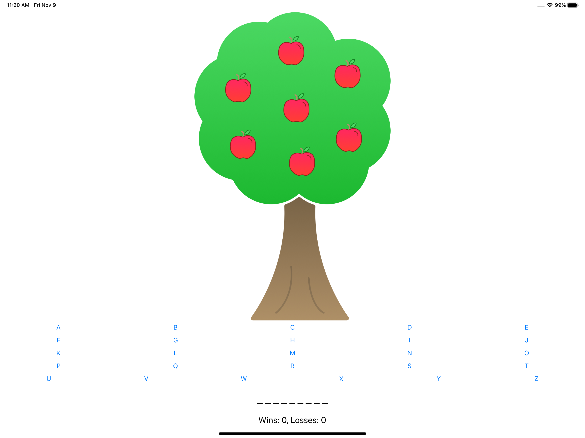
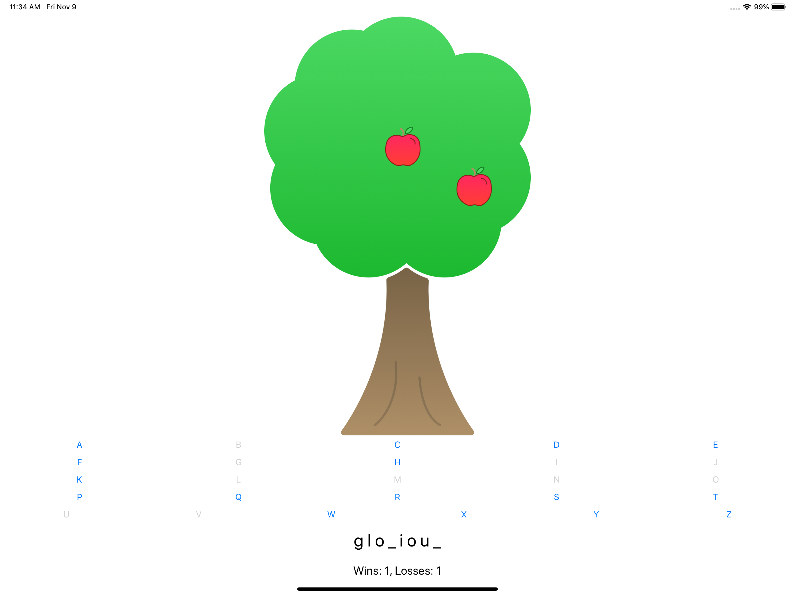

# SuzanZuurmond-Unit2-ApplePie

# Unit 2: Apple Pie
#### by Suzan Zuurmond (10791167)
End project of Unit 2. 

## Apple Pie
This game is simular to the Dutch game 'galgje', which let the player guess a certain word. In the beginning of the game, 
the player gets seven guesses (represented by the seven apples). Every time a player guesses wrong, an apple will fall/dissapear.

Here you see the begin-screen: 
 

Getting the right word, will give you one win. Getting seven guesses wrong, will give you a lose. Your status (how many winns
and loses) is shown on the screen.
 
